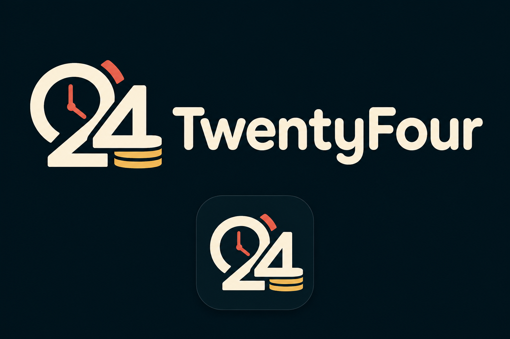

# TwentyFour ⏱️

### **Time = Money**

> Every hour has value. The question is — what are you going to do with it?

  
  
  
  

  
  
  
  

---

## 🧠 What is TwentyFour?

TwentyFour is a gamified productivity app built around one simple idea:

> **Your time should feel valuable.**

Instead of throwing a huge to-do list at you, TwentyFour gives you an actual **24-hour timeline**.

Plan your day → focus on what matters → earn coins → unlock rewards.

### **PLAN → FOCUS → EARN → UNLOCK**

---

## 🚀 What can you do with TwentyFour?

- 🕐 **Plan your entire day** across 24 real hours.
- 🎯 **Focus on specific tasks** with dedicated focus sessions.
- 🪙 **Earn coins** for focused time and completed tasks.
- 💰 **Track your progress** through your personal wallet.
- 🎁 **Unlock rewards** using the coins you've earned.
- 📊 **See where your day went** through productivity reports.
- 🔐 **Keep your workspace private** with authentication.
- ✨ **Personalize your experience** with unlockable rewards and themes.

---

## 🪙 The Coin System

The idea is simple:

**Your effort → Your coins → Your rewards**

| Action | Coins |
|---|---:|
| Focused work | Based on focused minutes + hourly rate |
| Complete a short task | +5 |
| Complete a medium task | +10 |
| Complete a difficult task | +20 |

> Coins are virtual in-app points and have **no real-world monetary value**.

---

## 🎯 The Core Experience

### 01 — PLAN 🕐

Look at your 24 hours and decide where your time is going.

### 02 — FOCUS 🎯

Start a focus session directly from a planned task and put the time in.

### 03 — EARN 🪙

Your focused time and completed tasks turn into coins.

### 04 — UNLOCK 🎁

Use those coins to unlock rewards and personalize your experience.

---

## 🛠️ Tech Stack

| Part | Technology |
|---|---|
| Frontend | React + Vite + TypeScript |
| Styling | Tailwind CSS |
| Animation | Framer Motion |
| Backend | Node.js + Express + TypeScript |
| Database | Supabase Postgres |
| Authentication | Supabase Auth |
| ORM | Prisma |
| Deployment | Vercel + Render |

---

## 📊 Project Status

**TwentyFour is currently an early-stage hackathon project.**

The core user journey and technical foundation are already in place, while we're continuing to improve the UI, accessibility, testing, and overall experience.

---

## 💡 Why TwentyFour?

Because productivity shouldn't always feel like:

> *"I still have 17 things left to do."*

It should feel like:

> **"I used my time well today."**

That's what TwentyFour is trying to build.

---

### ⏱️ Every hour has value.

## **Make it count.**

